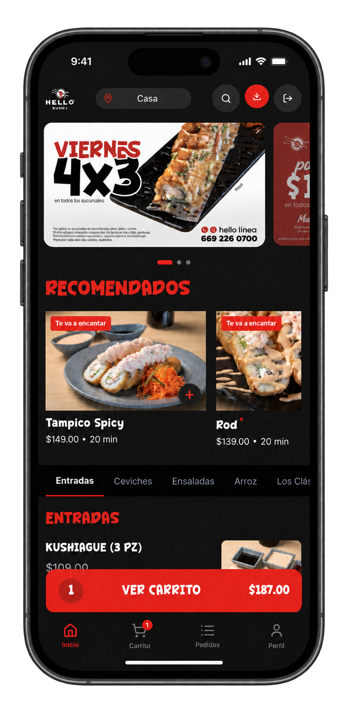

<picture>
  <source media="(max-width: 620px)" srcset="assets/hero-mobile.svg" />
  
</picture>

  <strong>Architecture · Payments · Real-time systems</strong> 
  I build restaurant commerce and operations systems around checkout, live orders, and branch workflows.

---

## What I build

I am a **software engineer and project architect** focused on payments, real-time order state, branch-scoped operations, external integrations, and recovery paths.

## Tech Stack

| Area | Technologies |
| --- | --- |
| Frontend | React 19 · Vite · TanStack Query · Zustand |
| Backend | TypeScript · Node.js · Express · Zod |
| Data | PostgreSQL · Drizzle · Redis |
| Messaging & real-time | RabbitMQ · Socket.IO |
| Integrations | Clip · Uber Eats APIs |

**Engineering practices:** idempotency · reconciliation · webhooks · branch isolation

The current table reflects verified Hello Sushi usage. The visual rows below are my broader personal toolkit across projects and generations; they are not a claim that every item runs in Hello Sushi.

### Personal toolkit

| Area | Technologies |
| --- | --- |
| Languages |  |
| Frontend |  |
| Backend |  |
| Databases |  |
| DevOps & CI/CD |  |

**Integrations across projects:** Stripe · Clip · Uber Eats APIs

**Project-specific:**

- **GestureCam:** Python · MediaPipe · OpenCV
- **iris-harness:** TypeScript · Effect · Engram *(in development)*

## Featured work

  

**Role:** project architect and full-stack contributor on a private client system. The detailed contribution summary is below; private implementation details, customer data, and private PR links stay private.

<picture>
  <source media="(max-width: 620px)" srcset="assets/metrics-panel-mobile.svg" />
  
</picture>

Snapshot: 351 merged PR records and 2,153 unique non-merge commits authored by <code>parkster127</code> across 8 Hello Sushi repositories and their default branches, from 2026-01-01 UTC through <code>2026-09-25T19:30:22Z</code>. The PR count includes release and synchronization records; the commit count excludes 434 merge commits. These are repository records, not unique features or deployments. <a href="METHODOLOGY.md">Read the counting method</a>.

## Projects

### Hello Sushi — restaurant operations platform

  

<a href="https://app.hellosushimex.com">Open the app URL</a>

Device mockup based on the supplied screenshot; the location label was adjusted for presentation. <a href="assets/hello-sushi-app-screenshot.png">View the unmodified original app screenshot</a>. This is not a literal device capture. The URL is supplied for context; this profile does not claim authenticated or operational access.

**My contribution:**

- Project architecture for checkout, live order state, and branch operations.
- Clip checkout with idempotency, 3DS API integration, and provider-facing state boundaries.
- PinPad attempt, inbox, reconciliation, and outbox paths for uncertain payment outcomes.
- Socket.IO + Redis branch rooms, RabbitMQ intake, Uber Eats normalization, and CEDIS/inventory workflows.

### [GestureCam](https://github.com/parkster127/gesturecam)

Python, MediaPipe, OpenCV, and virtual-camera workflows.

### [iris-harness](https://github.com/parkster127/iris-harness)

TypeScript, Effect, Engram tooling, and an evolving harness-independent agent platform.

<strong>Code volume context — accumulated PR diff volume</strong>

| Measure | Snapshot |
| --- | ---: |
| Additions across PR diffs | 1,197,465 |
| Deletions across PR diffs | 234,884 |
| Accumulated PR diff volume | 1,432,349 |

These are accumulated pull-request diff fields across the scoped repositories. They include regenerated, repeated, imported, and release changes; they are **not unique handwritten lines of code** and are provided as context rather than a quality or impact claim.

## How I approach systems

<strong>Four questions I bring to a production boundary</strong>

1. **What is the source of truth?** A request, a provider response, a persisted attempt, and a client event are not interchangeable.
2. **What is the failure state?** Decline, cancellation, provider failure, timeout, and unknown outcome need distinct recovery paths.
3. **Who can see or change it?** Branch-scoped authorization is part of the domain, not a UI detail.
4. **Can the team explain it later?** Correlation, durable records, and readable transitions make operational work reviewable.

---

**Build the system. Make the boundary visible.**

